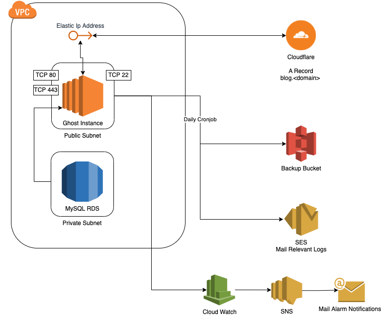

<h1 align="center"><code>Terraform AWS Ghost Blog</code></h1>

  Created by <a href="https://github.com/Gustavobelfort">Gustavo Belfort</a>

<a href="#">Terraform AWS Ghost Blog</a> is a repository that deploys a fully working ghost blog in AWS with domain management and caching managed thru Cloudflare

Ghost is a free and open source blogging platform written in JavaScript and distributed under the MIT License, designed to simplify the process of online publishing for individual bloggers as well as online publications.

More information at [ghost.org](https://ghost.org/).

## Features

* AWS Free tier elligible
* AWS SNS Notification alerts via email
* Ghost Blog Deployed into a EC2 instance
* Security policies and groups to ensure security
* Ghost admin url restricted to whitelisted IPs
* Cloudflare used as caching and domain management

## Why?

Who wants to manage all those moving pieces manually ?!

## Requirements

* An AWS account already setup
* A Cloudflare account already setup with a domain
* (Optional) A Terraform cloud account to use as a backend
* Terraform v1.1.4 installed

## How it works

We use terraform with [Terraform Cloud](https://cloud.hashicorp.com/products/terraform) as a backend to deploy and update the infrastructure running on AWS/Cloudflare.

We rely on the use of [Terraform Cloud Workspace variables](https://www.terraform.io/cloud-docs/workspaces/variables) (both environment and terraform ones) in order to provide the necessary values for the modules to run.

## General flow

1. Create a new Branch following GitFlow recommendations
    * Work on the new feature/update/bugfix
2. Create a Pull Request into master:
    * The Terraform Plan Pipeline is triggered
3. Admin merges the PR it into master:
    * The Terraform Apply Pipeline is triggered
    * An approval is required in Terraform Cloud to deploy resources

## Running locally

This repository is not planned to be run locally but you can do so by:

1. [Installing terraform](https://learn.hashicorp.com/terraform/getting-started/install.html)
2. Updating all the default values in variables.tf
3. Providing your remote state information in backend.tf -- feel free to remove terraform cloud if you're not using it as you default backend
4. Issuing:
    * `terraform init`
    * `terraform plan`
    * `terraform apply`

## Contributors

* Gustavo Belfort <a href="https://github.com/Gustavobelfort">(Gustavobelfort)</a>

Feel free to open a PR or create an issue if you'd like to improve the project!
